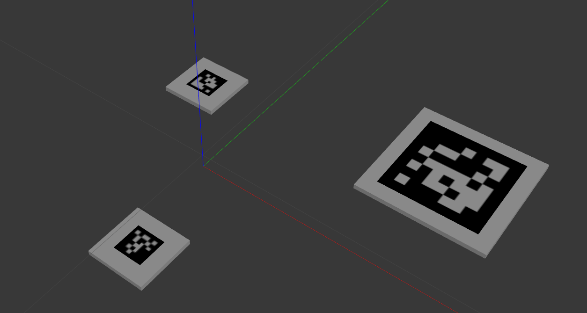

# ArUco_gazebo_tiles
Generate gazebo models of visual markers.


## Install

```bash
cd ArUco_gazebo_tiles
pip install -e .
export GAZEBO_MODEL_PATH=$GAZEBO_MODEL_PATH:$(pwd)/models # If you’re using Gazebo Classic
export GZ_SIM_RESOURCE_PATH=$GZ_SIM_RESOURCE_PATH:$(pwd)/models # If you’re using Ignition / Gazebo Sim (Fortress, Garden, Harmonic)
```

## How it works

Generate the tile model :
```bash
python3 generate_gazebo_tiles.py <DICT> <ID> <SIZE_IN_M>
# python3 generate_gazebo_tiles.py DICT_7X7_50 0 0.1
```

Visualize the marker tile via :
```bash
gazebo
# or
gz
```
Then insert the marker model.


## Overview


## ToDo / new features

## Contributors
- **Rémi Porée**